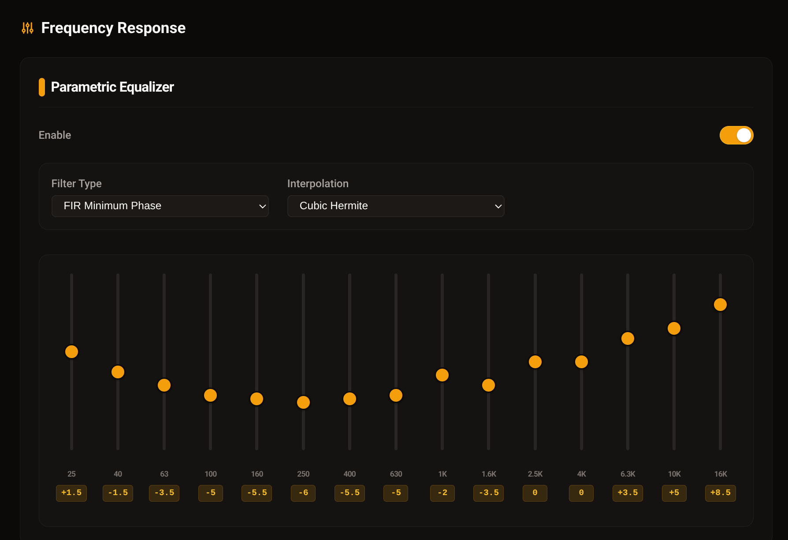

# James Bond

James Bond is a lightweight management suite for **JamesDSP headless**. It bridges the gap between the JamesDSP CLI and the web, providing a central server for authentication, preset management, and a visual control interface.

## Screenshots



## Road Map

- [x] JWT-based authentication (admin + client tokens)
- [x] DSP control API — EQ, bass, tube, convolver, sound position
- [x] Lit web client with DSP controls
- [x] Multi-stage Docker build (JamesDSP + server + web client)
- [ ] Preset management — save / load / switch EQ & DSP presets
- [ ] Impulse Response library — upload, browse, and apply IR files
- [ ] Mobile-optimized UI — responsive touch-friendly controls
...


## Core Components

### 🏗️ Backend (dsp-control-server)

A server providing:
- **Authentication**: Multi-client support (Admin/Clients).
- **Control API**: Translation of REST commands to JamesDSP CLI.
- **Storage**: Integrated management for IR (Impulse Responses), Presets, and Auth data.
- **Documentation**: Built-in API documentation.

### 🎨 Frontend (dsp-web-client)

A modern JS/HTML client built with **Lit**:
- **Configuration**: Dynamic server URL setup.
- **Connectivity**: Secure connection with authentication tokens.
- **Visual Editors**: Interactive Equalizer and Impulse Response editors.
- **Administration**: Management pages for backend control.
- **Integration**: Embeddable widget with client authentication.

## Getting Started

### Prerequisites

- [Go 1.26+](https://go.dev/dl/)
- [Node.js 22+](https://nodejs.org/)
- [JamesDSP headless](https://github.com/Audio4Linux/JDSP4Linux) (for runtime)
- Docker & Docker Compose (for containerized deployment)

### Configuration

Copy the example environment file and fill in your values:

```bash
cp .env.example .env
```

| Variable | Default | Description |
|---|---|---|
| `JB_SERVER_PORT` | `:8080` | Server listen address |
| `JB_DATA_DIR` | `./data` | Runtime data directory |
| `JB_JWT_SECRET` | — | **Required.** Secret for signing JWT tokens |
| `JB_JAMESDSP_BIN` | `jamesdsp` | Path to JamesDSP headless binary |
| `JB_ADMIN_USER` | `admin` | Admin login |
| `JB_ADMIN_PASS` | — | Admin password |
| `JB_CLIENT_TOKENS` | — | Comma-separated pre-issued client tokens |

### Run with Docker (recommended)

Pull the pre-built image from Docker Hub:

```bash
docker pull imone/james-bond:latest
```

Or build locally:

```bash
make docker-build
```

Run with Docker Compose (ensure PipeWire socket is available on the host):
*in progress*

### Development Mode

Run backend (Go) and frontend (Vite dev server) simultaneously:

```bash
make dev
```